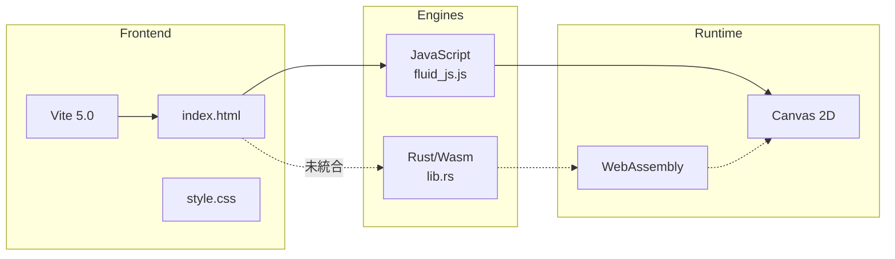
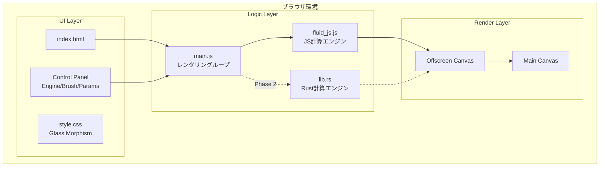
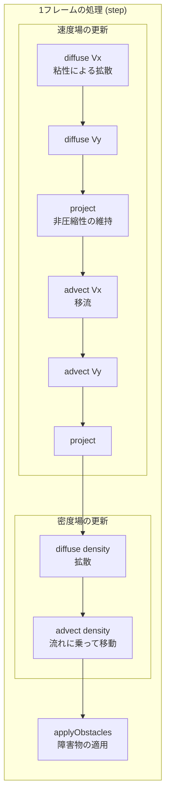
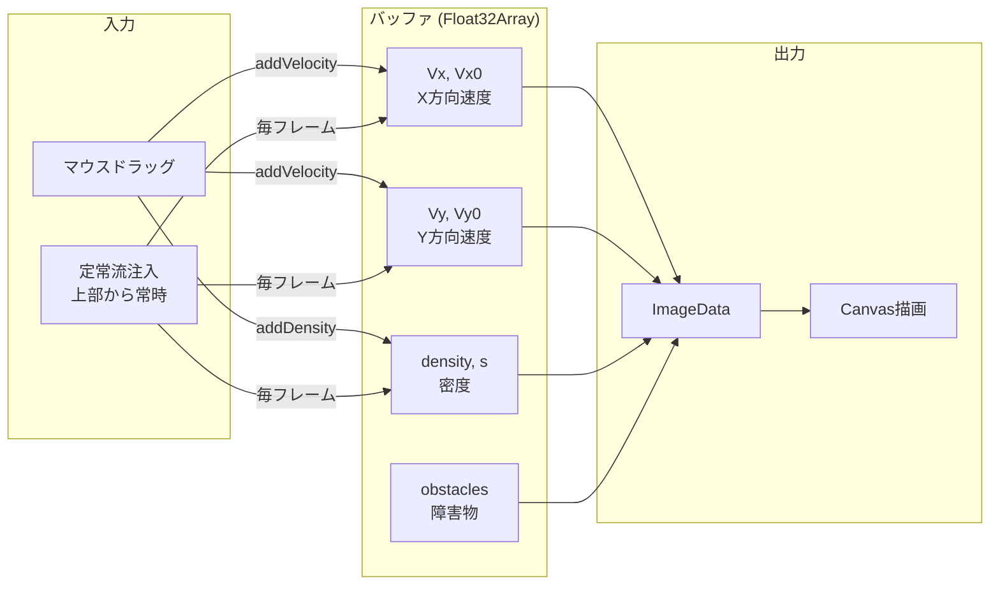
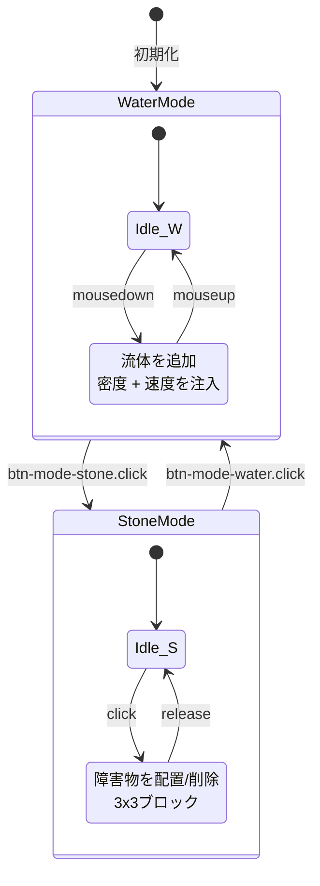
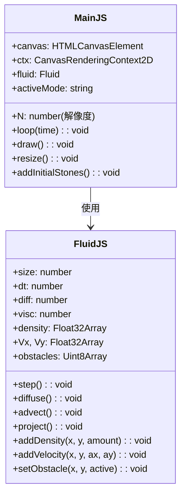
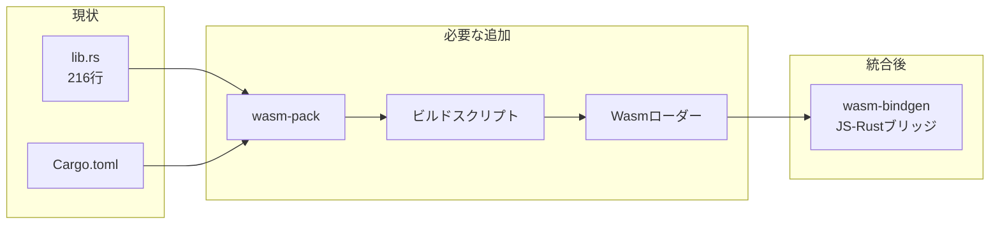
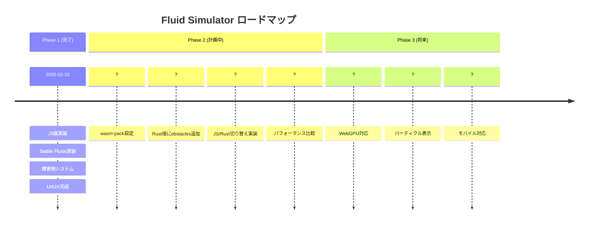

# Fluid Simulator - プロジェクトアーキテクチャ

> Stable Fluids アルゴリズムに基づくブラウザベースの流体シミュレーション

---

## 1. プロジェクト概要

| 項目 | 説明 |
|------|------|
| **名称** | Water Simulation |
| **目的** | リアルタイム流体シミュレーションの実装と、JS vs Rust(Wasm)のパフォーマンス比較 |
| **アルゴリズム** | Jos Stam 氏の "Real-Time Fluid Dynamics for Games" (Stable Fluids) |
| **特徴** | 川の流れ、障害物（石）の配置、インタラクティブな操作 |

---

## 2. 技術スタック



| カテゴリ | 技術 | 状態 |
|----------|------|------|
| ビルドツール | Vite 5.0 | ✅ 稼働中 |
| 言語 (Frontend) | JavaScript (ES6+) | ✅ 実装済み |
| 言語 (Backend) | Rust + wasm-bindgen | ⚠️ 未統合 |
| 描画 | Canvas 2D API | ✅ 実装済み |
| スタイリング | CSS (Glass Morphism) | ✅ 完了 |

---

## 3. システムアーキテクチャ

### 3.1 全体構成



### 3.2 Stable Fluids アルゴリズム



### 3.3 データフロー



### 3.4 UI状態遷移



---

## 4. コンポーネント詳細

### 4.1 main.js (エントリーポイント)



**責務:**
- Canvas の初期化とリサイズ
- マウスイベントの処理
- レンダリングループ (requestAnimationFrame)
- UI コントロールとの連携

### 4.2 fluid_js.js (流体計算エンジン)

**実装されているメソッド:**

| メソッド | 説明 | 計算量 |
|----------|------|--------|
| `diffuse(b, x, x0, diff, dt)` | 拡散 (Gauss-Seidel法, 40回反復) | O(N² × 40) |
| `advect(b, d, d0, vx, vy, dt)` | 移流 (双線形補間) | O(N²) |
| `project(vx, vy, p, div)` | 非圧縮性投影 | O(N² × 40) |
| `set_bnd(b, x)` | 境界条件設定 | O(N) |
| `set_custom_bnd(b, x)` | 障害物境界処理 | O(N²) |

### 4.3 lib.rs (Rust版 - 未統合)



**現在の実装状況:**
- ✅ `Fluid` 構造体定義
- ✅ `step()`, `diffuse()`, `advect()`, `project()` 実装
- ⚠️ `obstacles` バッファなし (JS版と仕様差異)
- ❌ ビルドパイプライン未構築
- ❌ JavaScript側からの呼び出し未実装

---

## 5. 既知の問題点

```mermaid
mindmap
  root((課題))
    未実装機能
      Rust/Wasm統合
      エンジン切り替えボタン
      障害物システム(Rust版)
    パフォーマンス
      高解像度(256+)でFPS低下
      JSメインスレッド占有
    ビルド
      wasm-pack設定なし
      package.jsonにビルドコマンドなし
```

| # | 問題 | 影響度 | 場所 | 状態 |
|---|------|--------|------|------|
| 1 | **Rust/Wasm 未統合** | 高 | `main.js`, `lib.rs` | ❌ 未対応 |
| 2 | **エンジン切り替え不可** | 高 | `index.html:36` (disabled) | ❌ 未対応 |
| 3 | **wasm-pack 設定なし** | 高 | `package.json` | ❌ 未対応 |
| 4 | **Rust版に obstacles なし** | 中 | `src-rust/lib.rs` | ❌ 未対応 |
| 5 | **高解像度でFPS低下** | 中 | `fluid_js.js` (lin_solve 40回) | ⚠️ 既知 |
| 6 | **JS/Rust インターフェース未定義** | 高 | - | ❌ 未対応 |

---

## 6. ファイル構成

```
water-simulation/
├── index.html              # エントリーポイント
├── package.json            # 依存関係 (Viteのみ)
├── vite.config.js          # Vite設定
├── Cargo.toml              # Rust設定
│
├── src/
│   ├── main.js             # メインロジック (238行)
│   ├── fluid_js.js         # JS計算エンジン (233行)
│   └── style.css           # スタイリング (172行)
│
├── src-rust/
│   └── lib.rs              # Rust計算エンジン (216行) ※未使用
│
├── dist/                   # ビルド出力
│   ├── index.html
│   └── assets/
│
└── docs/
    ├── ARCHITECTURE.md     # 本ドキュメント
    ├── DEVELOPMENT_LOG.md  # 開発ログ
    └── BLOGING_STRATEGY.md # ブログ戦略
```

---

## 7. ロードマップ



### 優先度別タスク

| 優先度 | タスク | 見積もり |
|--------|--------|----------|
| 🔴 高 | wasm-pack ビルド設定追加 | 1h |
| 🔴 高 | package.json にビルドコマンド追加 | 15min |
| 🔴 高 | Rust版に obstacles 実装 | 2h |
| 🔴 高 | main.js で Wasm ロード & 切り替え | 3h |
| 🟡 中 | パフォーマンス計測UI追加 | 2h |
| 🟢 低 | WebGPU シェーダー実装 | 1週間 |

---

## 8. 参考資料

- [Jos Stam - Real-Time Fluid Dynamics for Games](https://www.dgp.toronto.edu/~stam/reality/Research/pdf/GDC03.pdf)
- [wasm-bindgen Documentation](https://rustwasm.github.io/wasm-bindgen/)
- [Vite Documentation](https://vitejs.dev/)
